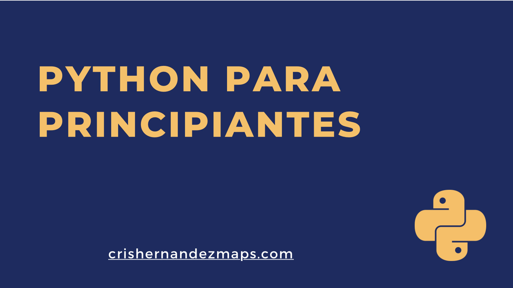

# 0 Presentación del curso

## 0.1 Sobre el instructor
Mi nombre es **Cristian Hernández**, científico de datos. Me he dedicado los últimos diez años a la programación en Python para resolver problemas de diversas industrias:

> 11 Años de experiencia en ciencia de datos
> 5 Industrias 
> 9 Países

Quisiéra que este curso sea el primer paso en Python para personas en muchas partes del mundo, y que encuentren aquí lo que necesitan para comenzar.


## 0.2 Curso de Python para Principiantes

Link al índice: https://github.com/crishernandezmaps/udemy-python-basico
Link al perfil del tutor: https://crishernandezmaps.com

Este curso está diseñado para que inicies el camino a ser un experto en el arte de la programación. Python, conocido por su sintaxis clara y por buscar ser legible. Se ha consolidado como el lenguaje favorito para desarrolladores en campos tan diversos como la ciencia de datos, el desarrollo web, y la automatización. Este curso te llevará de la mano desde los conceptos más básicos técnicas avanzadas, equipándote con todo lo necesario para dominar este poderoso lenguaje.

## 0.3 ¿Qué Aprenderás?
- **Fundamentos de Python**: Empieza desde cero y construye una sólida comprensión de los fundamentos de Python, incluyendo variables, tipos de datos, estructuras de control, y funciones.
- **Programación orientada a objetos**: Profundiza en temas avanzados como la Programación Orientada a Objetos (POO), el manejo de excepciones, y el trabajo con bibliotecas externas.
- **Análisis de Datos**: Descubre cómo Python se convierte en una herramienta indispensable en el análisis de datos con la ayuda de bibliotecas como Pandas y NumPy.
- **Visualización de Datos**: Aprende a contar historias con tus datos a través de visualizaciones impactantes con Matplotlib y Seaborn.
- **Automatización**: Automatiza tareas aburridas y repetitivas, ahorrando tiempo y recursos.
- **Proyectos Prácticos**: Refuerza lo aprendido con proyectos prácticos que simulan desafíos reales, desde el análisis de datos simples hasta la creación de una aplicación web básica.

## 0.4 ¿A Quién Está Dirigido?
Este curso está diseñado tanto para principiantes que desean adentrarse en el mundo de la programación como para profesionales que buscan ampliar sus habilidades y aprovechar el poder de Python en sus proyectos.

## 0.5 Al Final del Curso
Estarás equipado con las habilidades necesarias para abordar problemas reales, analizar grandes conjuntos de datos, desarrollar aplicaciones web, y mucho más. Además, te convertirás en parte de una comunidad activa y creciente, donde el aprendizaje continuo y el intercambio de conocimientos te abrirán puertas a nuevas oportunidades.

¡Embárcate en este viaje hacia el dominio de Python y da el primer paso hacia tu futuro en tecnología hoy mismo!

---

## 1. Introducción a Python
- 1.1 Historia de Python
- 1.2 Filosofía y aplicaciones
- 1.3 Jupyter Notebook y el uso de Google Colab como entorno interactivo en la nube para Python

## 2. Primeros Pasos con Python
- 2.1 Sintaxis básica
- 2.2 Tipos de datos (números, cadenas de texto, booleanos)
- 2.3 Operadores (aritméticos, de comparación, lógicos)

## 3. Estructuras de Datos
- 3.1 Listas y tuplas
- 3.2 Diccionarios y conjuntos
- 3.3 Comprensiones de listas

## 4. Control de Flujo
- 4.1 Sentencias condicionales (`if`, `elif`, `else`)
- 4.2 Bucles (`for`, `while`)
- 4.3 Manejo de excepciones (`try`, `except`, `finally`)

## 5. Funciones y Módulos
- 5.1 Definición y llamada de funciones
- 5.2 Parámetros y argumentos
- 5.3 Importación de módulos y paquetes

## 6. Programación Orientada a Objetos (POO)
- 6.1 Clases y objetos
- 6.2 Herencia y polimorfismo
- 6.3 Encapsulamiento y métodos especiales

## 7. Manejo de Archivos
- 7.1 Lectura y escritura de archivos
- 7.2 Trabajo con archivos en diferentes formatos (texto, CSV, JSON)

## 8. Bibliotecas Populares en Python
- 8.1 NumPy para cálculos numéricos
- 8.2 Pandas para análisis de datos
- 8.3 Matplotlib y Seaborn para visualización de datos
- 8.4 Requests para acceso a web

## 9. Proyectos Prácticos
- 9.1 Proyecto 1: Análisis de datos simples
- 9.2 Proyecto 2: Creación de un web scraper
- 9.3 Proyecto 3: Desarrollo de una aplicación web básica

## 10. Conclusión y Recursos Comunitarios
- 10.1 Mejores prácticas y consejos
- 10.2 Cómo continuar aprendiendo
- 10.3 Participación en la comunidad Python

---

# 1. Introducción a Python

## 1.1 Historia de Python

### 1.1.1 Introducción
Bienvenidos a la sección dedicada a la historia de Python. En esta parte, exploraremos cómo surgió Python, quién lo creó, y qué lo hace tan especial en el mundo del desarrollo de software.

### 1.1.2 Orígenes de Python
Python fue creado a finales de los años 80 por Guido van Rossum, en el Centro para las Matemáticas y la Informática (CWI, por sus siglas en neerlandés) en los Países Bajos. La idea era desarrollar un lenguaje de programación que enfatizara la legibilidad del código, permitiendo a los programadores expresar conceptos en menos líneas de código en comparación con C++ o Java.

### 1.1.3 Inspiración
El nombre "Python" no proviene del reptil, sino del programa de televisión británico "Monty Python's Flying Circus", del cual van Rossum era fanático. Esto refleja el enfoque de Python hacia la simplicidad y su comunidad que valora el humor y la curiosidad.

### 1.1.4 Filosofía
La filosofía de diseño de Python se resume en el "Zen de Python", una colección de 19 principios para escribir programas de computadora que son visibles al ejecutar `import this`. Algunos de estos principios incluyen "Hermoso es mejor que feo", "Explícito es mejor que implícito", y "Simple es mejor que complejo".

### 1.1.5 Evolución
Python 1.0 se lanzó en enero de 1994. Python 2.0, lanzado en el año 2000, introdujo muchas características nuevas, como la recolección de basura y la comprensión de listas. Python 3.0, lanzado en 2008, fue una revisión mayor que no era completamente compatible con las versiones anteriores, pero introdujo mejoras significativas para superar las limitaciones de diseño del lenguaje.

### 1.1.6 Python Hoy
Hoy, Python es uno de los lenguajes de programación más populares en el mundo. Se utiliza en una variedad de aplicaciones, desde desarrollo web hasta ciencia de datos, inteligencia artificial y aprendizaje automático. La comunidad de Python sigue creciendo, ofreciendo una vasta cantidad de recursos, bibliotecas y marcos de trabajo para soportar el desarrollo en casi cualquier área.

> Conclusión: La historia de Python es una de innovación constante y crecimiento comunitario. Desde sus humildes comienzos hasta convertirse en un pilar del desarrollo de software moderno, Python ha demostrado ser un lenguaje versátil y poderoso. Ahora, pasemos a explorar más sobre la filosofía que guía su diseño y uso.


## 1.2 Filosofía y Aplicaciones de Python

### 1.2.1 Introducción
En esta sección, profundizaremos en la filosofía que guía el desarrollo de Python y exploraremos algunas de las aplicaciones más comunes de este versátil lenguaje de programación.

### 1.2.2 La Filosofía de Python
La filosofía de Python se puede resumir en una serie de principios conocidos como el "Zen de Python", que enfatiza la importancia de la legibilidad, la simplicidad y la explicitud en la programación. Algunos de los principios más destacados incluyen:

- "Bello es mejor que feo".
- "Explícito es mejor que implícito".
- "Simple es mejor que complejo".
- "La legibilidad cuenta".

Estos principios guían el diseño del lenguaje y las prácticas de programación en la comunidad de Python, haciendo que el código sea accesible y mantenible.

### 1.2.3 Aplicaciones de Python
Python es un lenguaje de programación de alto nivel, interpretado y de propósito general, conocido por su versatilidad y su amplia gama de aplicaciones. Algunas de las áreas donde Python se ha convertido en una herramienta indispensable incluyen:

#### 1.2.3.1 Desarrollo Web
Python ofrece frameworks potentes como Django y Flask, que facilitan la creación de aplicaciones web robustas, escalables y seguras.

#### 1.2.3.2 Ciencia de Datos
Python es el lenguaje preferido para la ciencia de datos y el análisis estadístico, gracias a bibliotecas como Pandas, NumPy y SciPy que permiten manipular, procesar y analizar grandes conjuntos de datos.

#### 1.2.3.3 Inteligencia Artificial y Aprendizaje Automático
Con bibliotecas como TensorFlow, Keras y PyTorch, Python es líder en el desarrollo de proyectos de inteligencia artificial, aprendizaje automático y deep learning.

#### 1.2.3.4 Automatización y Scripting
Python es una herramienta excelente para la automatización de tareas repetitivas y el scripting, permitiendo a los usuarios ahorrar tiempo y reducir errores.

#### 1.2.3.5 Desarrollo de Videojuegos
Python también se utiliza en el desarrollo de videojuegos, ofreciendo librerías como Pygame, que facilitan la creación de juegos de forma rápida y sencilla.

> Conclusión: La combinación de una filosofía de diseño enfocada en la claridad y la simplicidad, junto con una amplia gama de aplicaciones prácticas, hace de Python un lenguaje de programación excepcionalmente poderoso y popular. Su comunidad activa y el soporte constante aseguran que Python seguirá siendo una herramienta vital en el mundo del desarrollo de software por años venideros.


## 1.3 Jupyter Notebook y el uso de Google Colab como entorno interactivo en la nube para Python
Jupyter Notebook es una aplicación web que permite crear y compartir documentos que contienen código en vivo, ecuaciones, visualizaciones y texto narrativo. Es una herramienta ideal para el aprendizaje de Python, la experimentación con algoritmos y el análisis de datos.

### 1.3.1 Uso de Google Colab como Entorno Interactivo
Google Colab es un servicio gratuito que integra Jupyter Notebook en la nube, permitiéndote escribir y ejecutar código de Python en tu navegador sin ninguna configuración previa. Colab está especialmente diseñado para el aprendizaje de machine learning, análisis de datos, y educación.

### 1.3.2 Ventajas de Google Colab
- No requiere instalación.
- Acceso gratuito a GPUs y TPUs para el aprendizaje de machine learning.
- Facilidad para compartir y colaborar en notebooks de forma similar a Google Docs.

Para comenzar con Google Colab, visita:

```url
https://colab.research.google.com
```

y selecciona "Nuevo cuaderno" para empezar a escribir código de Python en un entorno interactivo y colaborativo.

> Conclusión: El uso de Jupyter Notebook y Google Colab brinda una plataforma interactiva y accesible para aprender Python, experimentar con código y realizar análisis de datos complejos, todo dentro de un entorno colaborativo en la nube.

---

# 2. Primeros Pasos con Python: 

## 2.1 Sintaxis Básica

### 2.1.1 Introducción
Bienvenidos a la sección sobre los primeros pasos en Python, donde nos sumergiremos en la sintaxis básica de este poderoso lenguaje de programación. Python es conocido por su legibilidad y simplicidad, lo que facilita el aprendizaje para los principiantes.

### 2.1.2 Comentarios
Los comentarios en Python comienzan con el símbolo `#`. Todo lo que sigue a este símbolo en la línea será ignorado por el intérprete de Python, lo que te permite agregar notas y explicaciones a tu código.

```python
# Esto es un comentario
```

### 2.1.3 Indentación
A diferencia de otros lenguajes, Python utiliza la indentación para delimitar bloques de código. La consistencia en la indentación es crucial, ya que una mala indentación puede llevar a errores de sintaxis.

```python
if 5 > 2:
    print("Cinco es mayor que dos")
```

### 2.1.4 Variables
En Python, no necesitas declarar el tipo de una variable al crearla; el lenguaje determina el tipo automáticamente al asignarle un valor.

```python
x = 5
nombre = "Juan"
```

### 2.1.5 Tipos de Datos Básicos
Python tiene varios tipos de datos estándar que son comúnmente usados:
- Números: `int`, `float`
- Texto: `str`
- Booleano: `bool` (True, False)

```python
edad = 30             # int
altura = 1.75         # float
nombre = "Ana"        # str
es_estudiante = True  # bool
```

### 2.1.6 Operadores Básicos
Python incluye una variedad de operadores estándar para realizar cálculos matemáticos, comparaciones y operaciones lógicas.

#### 2.1.6.1 Matemáticos
- Suma: `+`
- Resta: `-`
- Multiplicación: `*`
- División: `/`

#### 2.1.6.2 De Comparación
- Igual: `==`
- No igual: `!=`
- Mayor que: `>`
- Menor que: `<`

#### 2.1.6.3 Lógicos
- and
- or
- not

### 2.1.7 Funciones Básicas
Python tiene un conjunto de funciones incorporadas. Por ejemplo, `print()` se usa para enviar texto a la salida estándar.

```python
print("Hola, mundo")
```

> Conclusión: Con estas bases de la sintaxis de Python, estás listo para comenzar a explorar más sobre la programación en Python. La simplicidad y claridad de Python lo hacen ideal para principiantes, permitiéndote concentrarte en aprender conceptos de programación sin la complejidad de una sintaxis complicada.


## 2.2 Tipos de Datos en Python

### 2.2.1 Introducción
Continuando con nuestro curso de Python para principiantes, esta sección se centra en los tipos de datos fundamentales en Python: números, cadenas de texto y booleanos. Estos tipos de datos son los bloques de construcción básicos utilizados en todos los programas de Python.

### 2.2.2 Números
Python soporta varios tipos de números, incluidos enteros (`int`) y de punto flotante (`float`). Veamos cómo trabajar con estos tipos de números.

#### 2.2.2.1 Enteros
Los enteros son números sin punto decimal. Pueden ser positivos o negativos.

```python
edad = 25
print(edad)
```

#### 2.2.2.2 Flotantes
Los números de punto flotante tienen un punto decimal y pueden representar fracciones además de números enteros.

```python
altura = 1.75
print(altura)
```

### 2.2.3 Cadenas de Texto
Las cadenas de texto (`str`) se utilizan para representar texto. Puedes definirlas usando comillas simples (`'`) o dobles (`"`).

```python
nombre = "Juan"
saludo = 'Hola, ' + nombre
print(saludo)
```

#### 2.2.3.1 Multilínea
Para cadenas de texto que abarcan múltiples líneas, utiliza tres comillas dobles o simples.

```python
mensaje = """Este es un mensaje
que abarca varias
líneas."""
print(mensaje)
```

### 2.2.4 Booleanos
Los valores booleanos (`bool`) representan verdadero o falso y son fundamentales en las operaciones lógicas.

```python
es_estudiante = True
tiene_credencial = False
print(es_estudiante)
print(tiene_credencial)
```

### 2.2.5 Operaciones con Tipos de Datos
Cada tipo de dato tiene operaciones específicas que se pueden realizar con él. Por ejemplo, puedes sumar números, concatenar cadenas de texto y realizar operaciones lógicas con booleanos.

#### 2.2.5.1 Operaciones Numéricas

```python
suma = 5 + 3
print(suma)
```

#### 2.2.5.2 Concatenación de Cadenas

```python
nombre_completo = "Juan" + " " + "Pérez"
print(nombre_completo)
```

#### 2.2.5.3 Operaciones Booleanas

```python
resultado = es_estudiante and tiene_credencial
print(resultado)
```

> Conclusión: Entender los tipos de datos básicos en Python y cómo operar con ellos es fundamental para cualquier programador. En la siguiente sección, exploraremos estructuras de datos más complejas que te permitirán almacenar y manipular colecciones de datos.

## 2.3 Operadores en Python

### 2.3.1 Introducción
Avanzando en nuestro curso de Python para principiantes, ahora exploraremos los operadores en Python. Los operadores permiten realizar operaciones sobre variables y valores. Python divide los operadores en varias categorías: aritméticos, de comparación y lógicos.

### 2.3.2 Operadores Aritméticos
Los operadores aritméticos se utilizan con valores numéricos para realizar operaciones matemáticas comunes.

#### 2.3.2.1 Suma (`+`)
```python
resultado = 10 + 5
print(resultado)  # Salida: 15
```

#### 2.3.2.2 Resta (`-`)
```python
resultado = 10 - 5
print(resultado)  # Salida: 5
```

#### 2.3.2.3 Multiplicación (`*`)
```python
resultado = 10 * 5
print(resultado)  # Salida: 50
```

#### 2.3.2.4 División (`/`)
```python
resultado = 10 / 5
print(resultado)  # Salida: 2.0
```

#### 2.3.2.5 Módulo (`%`)
```python
resultado = 10 % 3
print(resultado)  # Salida: 1
```

#### 2.3.2.6 Potencia (`**`)
```python
resultado = 2 ** 3
print(resultado)  # Salida: 8
```

#### 2.3.2.7 División Entera (`//`)
```python
resultado = 10 // 3
print(resultado)  # Salida: 3
```

### 2.3.3 Operadores de Comparación
Los operadores de comparación se usan para comparar dos valores.

#### 2.3.3.1 Igual (`==`)
```python
resultado = (10 == 5)
print(resultado)  # Salida: False
```

#### 2.3.3.2 No igual (`!=`)
```python
resultado = (10 != 5)
print(resultado)  # Salida: True
```

#### 2.3.3.3 Mayor que (`>`)
```python
resultado = (10 > 5)
print(resultado)  # Salida: True
```

#### 2.3.3.4 Menor que (`<`)
```python
resultado = (10 < 5)
print(resultado)  # Salida: False
```

#### 2.3.3.5 Mayor o igual que (`>=`)
```python
resultado = (10 >= 10)
print(resultado)  # Salida: True
```

#### 2.3.3.6 Menor o igual que (`<=`)
```python
resultado = (10 <= 10)
print(resultado)  # Salida: True
```

### 2.3.4 Operadores Lógicos
Los operadores lógicos se utilizan para combinar declaraciones condicionales.

#### 2.3.4.1 and
```python
resultado = (True and True)
print(resultado)  # Salida: True
```

#### 2.3.4.2 or
```python
resultado = (True or False)
print(resultado)  # Salida: True
```

#### 2.3.4.3 not
```python
resultado = not(True)
print(resultado)  # Salida: False
```

> Conclusión: Los operadores en Python son herramientas esenciales que permiten realizar operaciones matemáticas, comparar valores y ejecutar operaciones lógicas. Dominar su uso es fundamental para la programación efectiva en Python. En la próxima sección, avanzaremos hacia estructuras de control de flujo, donde aplicaremos estos operadores en contextos más complejos.

---

# 3. Estructuras de Datos en Python: 

## 3.1 Listas y Tuplas

### 3.1.1 Introducción
Continuando con nuestro curso de Python para principiantes, esta sección cubre dos estructuras de datos fundamentales: las listas y las tuplas. Ambas son cruciales para almacenar colecciones de datos en Python, pero se utilizan en diferentes contextos debido a sus características únicas.

### 3.1.2 Listas
Las listas en Python son colecciones ordenadas y modificables. Permiten almacenar una lista de elementos, que pueden ser de diferentes tipos de datos.

#### 3.1.2.1 Creación de Listas
```python
frutas = ["manzana", "banana", "cereza"]
print(frutas)
```

#### 3.1.2.2 Acceso a Elementos
```python
print(frutas[1])  # Accede al segundo elemento: banana
```

#### 3.1.2.3 Modificar Valores
```python
frutas[1] = "aguacate"
print(frutas)  # Cambia "banana" por "aguacate"
```

#### 3.1.2.4 Añadir Elementos
```python
frutas.append("naranja")
print(frutas)  # Añade "naranja" al final de la lista
```

#### 3.1.2.5 Eliminar Elementos
```python
frutas.remove("manzana")
print(frutas)  # Elimina "manzana" de la lista
```

### 3.1.3 Tuplas
Las tuplas son colecciones ordenadas y no modificables. Se utilizan para almacenar múltiples elementos en una sola variable.

#### 3.1.3.1 Creación de Tuplas
```python
vehiculos = ("bicicleta", "moto", "coche")
print(vehiculos)
```

#### 3.1.3.2 Acceso a Elementos
```python
print(vehiculos[2])  # Accede al tercer elemento: coche
```

#### 3.1.3.3 Intento de Modificación (Produce Error)
Intentar modificar una tupla resultará en un error, ya que las tuplas son inmutables.

```python
# vehiculos[1] = "autobús"  # Esto causaría un TypeError
```

#### 3.1.3.4 Tuplas Unicampo
Para crear una tupla con un solo elemento, necesitas incluir una coma al final.

```python
mi_tupla = ("manzana",)
print(type(mi_tupla))  # Salida: <class 'tuple'>
```

> Conclusión: Las listas y las tuplas son estructuras de datos fundamentales en Python con sus propios conjuntos de operaciones y usos. Las listas son ideales para colecciones de datos que necesitan ser modificadas, mientras que las tuplas se utilizan mejor para colecciones de datos inmutables. Comprender cómo y cuándo usar cada una de estas estructuras te permitirá gestionar colecciones de datos de manera más efectiva en tus programas de Python.

## 3.2 Diccionarios y Conjuntos

### 3.2.1 Introducción
Profundizando en las estructuras de datos de Python, exploraremos ahora los diccionarios y los conjuntos. Estas estructuras ofrecen maneras únicas de almacenar y manipular datos, cada una con sus características y casos de uso específicos.

### 3.2.2 Diccionarios
Los diccionarios en Python son colecciones no ordenadas de pares clave-valor. Permiten almacenar datos de manera que se puedan recuperar eficientemente usando una clave.

#### 3.2.2.1 Creación de Diccionarios
```python
persona = {
    "nombre": "Juan",
    "edad": 30,
    "ciudad": "Madrid"
}
print(persona)
```

#### 3.2.2.2 Acceso a Elementos
```python
print(persona["nombre"])  # Muestra "Juan"
```

#### 3.2.2.3 Añadir o Modificar Elementos
```python
persona["profesión"] = "Ingeniero"
print(persona)  # Añade o actualiza la clave "profesión"
```

#### 3.2.2.4 Eliminar Elementos
```python
del persona["edad"]
print(persona)  # Elimina la clave "edad"
```

### 3.2.3 Conjuntos
Los conjuntos (sets) son colecciones no ordenadas, modificables, pero sin elementos duplicados. Son ideales para la eliminación de duplicados y las operaciones matemáticas de conjuntos.

#### 3.2.3.1 Creación de Conjuntos
```python
frutas = {"manzana", "banana", "cereza"}
print(frutas)
```

#### 3.2.3.2 Añadir Elementos
```python
frutas.add("naranja")
print(frutas)
```

#### 3.2.3.3 Eliminar Elementos
```python
frutas.remove("banana")
print(frutas)  # Elimina "banana" del conjunto
```

#### 3.2.3.4 Operaciones de Conjuntos
Los conjuntos soportan operaciones matemáticas como unión, intersección, diferencia y diferencia simétrica.

##### 3.2.3.4.1 Unión
```python
conjunto_a = {1, 2, 3}
conjunto_b = {3, 4, 5}
union = conjunto_a.union(conjunto_b)
print(union)  # {1, 2, 3, 4, 5}
```

##### 3.2.3.4.2 Intersección
```python
interseccion = conjunto_a.intersection(conjunto_b)
print(interseccion)  # {3}
```

> Conclusión: Los diccionarios y los conjuntos son estructuras de datos poderosas en Python que ofrecen formas eficientes de manejar datos. Mientras que los diccionarios son ideales para trabajar con relaciones de clave-valor, los conjuntos son útiles para operaciones que involucran grupos de elementos únicos. Dominar estas estructuras de datos expandirá significativamente tus capacidades de programación en Python.
 

## 3.3 Comprensiones de Listas en Python

### 3.3.1 Introducción
Las comprensiones de listas ofrecen una forma concisa de crear listas. Este enfoque transforma iteraciones y operaciones de filtrado sobre elementos de una lista (o cualquier iterable) en una expresión concisa y fácil de leer.

### 3.3.2 Ejemplo Básico
Imaginemos que queremos crear una lista de los cuadrados de los números del 0 al 9.

#### 3.3.2.1 Sin Comprensión de Lista
```python
cuadrados = []
for x in range(10):
    cuadrados.append(x**2)
print(cuadrados)
```

#### 3.3.2.2 Con Comprensión de Lista
```python
cuadrados = [x**2 for x in range(10)]
print(cuadrados)
```

### 3.3.3 Filtrando Elementos
Las comprensiones de listas también pueden incluir una condición para filtrar elementos de la lista final.

#### 3.3.3.1 Ejemplo de Filtrado
```python
cuadrados_pares = [x**2 for x in range(10) if x % 2 == 0]
print(cuadrados_pares)
```

### 3.3.4 Comprensiones Anidadas
Puedes anidar comprensiones de listas para realizar operaciones más complejas.

#### 3.3.4.1 Ejemplo de Anidamiento
```python
# Crear una matriz 3x4 con comprensiones de listas
matriz = [[j for j in range(4)] for i in range(3)]
print(matriz)
```

> Conclusión: Las comprensiones de listas son una herramienta poderosa que simplifica el código al crear nuevas listas a partir de iterables existentes. Permiten realizar bucles, operaciones matemáticas y filtrados en una sola línea de código. Su uso adecuado puede hacer que tu código sea más Pythonic, es decir, más claro, más elegante y más eficiente.

---

# 4. Control de Flujo
## 4.1 Sentencias condicionales (`if`, `elif`, `else`)

## 4.2 Introducción
Las sentencias condicionales son fundamentales en cualquier lenguaje de programación, permitiendo a los programas ejecutar diferentes acciones basadas en condiciones específicas. Python utiliza `if`, `elif`, y `else` para manejar la lógica condicional.

## 4.3 Sentencia `if`
La sentencia `if` se usa para ejecutar un bloque de código si, y solo si, una condición específica es verdadera.

```python
edad = 20
if edad >= 18:
    print("Eres mayor de edad.")
```

## 4.4 Sentencia `else`
La sentencia `else` complementa a `if`, ejecutando un bloque de código cuando la condición del `if` es falsa.

```python
if edad < 18:
    print("Eres menor de edad.")
else:
    print("Eres mayor de edad.")
```

## 4.5 Sentencia `elif`
`elif` (abreviatura de "else if") permite verificar múltiples expresiones para ser verdaderas y ejecutar un bloque de código tan pronto como una de las condiciones se evalúa como verdadera.

```python
if edad < 13:
    print("Eres un niño.")
elif edad < 18:
    print("Eres un adolescente.")
else:
    print("Eres adulto.")
```

## 4.6 Combinando Condicionales
Puedes combinar `if`, `elif`, y `else` para crear lógicas condicionales complejas.

### 4.6.1 Ejemplo
```python
puntuacion = 85

if puntuacion >= 90:
    print("Excelente")
elif puntuacion >= 80:
    print("Bien")
elif puntuacion >= 70:
    print("Suficiente")
else:
    print("Mejor suerte la próxima vez")
```

> Conclusión: Las sentencias condicionales `if`, `elif`, y `else` son herramientas poderosas en Python que te permiten controlar el flujo de tus programas con precisión. A través de su uso, puedes asegurar que ciertos bloques de código se ejecuten solo bajo condiciones específicas, lo que es esencial para la toma de decisiones en la programación.


## 4.2 Bucles (`for`, `while`)

### 4.2.1 Introducción
Los bucles son estructuras de control fundamentales en cualquier lenguaje de programación, permitiendo ejecutar un bloque de código repetidamente bajo ciertas condiciones. Python ofrece dos tipos de bucles: `for` y `while`.

### 4.2.2 Bucle `for`
El bucle `for` en Python se utiliza para iterar sobre una secuencia (que puede ser una lista, una tupla, un diccionario, un conjunto o una cadena).

#### 4.2.2.1 Ejemplo con Lista
```python
frutas = ["manzana", "banana", "cereza"]
for fruta in frutas:
    print(fruta)
```

#### 4.2.2.2 Ejemplo con `range()`
```python
for i in range(5):
    print(i)
```

### 4.2.3 Bucle `while`
El bucle `while` ejecuta un conjunto de instrucciones mientras una condición sea verdadera.

#### 4.2.3.1 Ejemplo Básico
```python
contador = 1
while contador <= 5:
    print(contador)
    contador += 1
```

### 4.2.4 Control de Bucles
Python ofrece declaraciones de control de bucles como `break` y `continue` para modificar el comportamiento de los bucles `for` y `while`.

#### 4.2.4.1 Uso de `break`
`break` se utiliza para salir del bucle más cercano.

```python
for i in range(10):
    if i == 5:
        break
    print(i)
```

#### 4.2.4.2 Uso de `continue`
`continue` se utiliza para saltar el resto del código dentro del bucle para la iteración actual y continuar con la siguiente.

```python
for i in range(10):
    if i % 2 == 0:
        continue
    print(i)
```

> Conclusión: Los bucles `for` y `while` son herramientas esenciales en Python que permiten ejecutar código repetidamente hasta que se cumpla una condición específica. Combinados con declaraciones de control como `break` y `continue`, ofrecen un control flexible sobre el flujo de ejecución de tu programa, permitiéndote manejar complejas lógicas de repetición de manera eficiente.

## 4.3 Manejo de Excepciones

### 4.3.1 Introducción
El manejo de excepciones es un aspecto crucial de la programación en Python, permitiendo a los desarrolladores controlar errores de manera elegante y continuar la ejecución del programa incluso cuando ocurren problemas inesperados.

### 4.3.2 Estructura Básica
La estructura básica para manejar excepciones en Python utiliza `try`, `except`, y opcionalmente `finally`.

#### 4.3.2.1 Uso de `try` y `except`
```python
try:
    # Intenta ejecutar este bloque de código
    resultado = 10 / 0
except ZeroDivisionError:
    # Ejecuta este bloque si hay una división por cero
    print("¡Error! División por cero.")
```

#### 4.3.2.2 Capturando Múltiples Excepciones
Puedes capturar múltiples tipos de excepciones en un solo bloque `except` o usando múltiples bloques `except`.

```python
try:
    # Código que puede lanzar más de un tipo de excepción
    resultado = 10 / "manzana"
except ZeroDivisionError:
    print("División por cero.")
except TypeError:
    print("Tipo de dato no válido para la operación.")
```

#### 4.3.2.3 Uso de `finally`
El bloque `finally` se ejecuta siempre, independientemente de si se lanzó una excepción o no, siendo útil para realizar tareas de limpieza.

```python
try:
    resultado = 10 / 2
except ZeroDivisionError:
    print("División por cero.")
finally:
    print("Este bloque se ejecuta siempre.")
```

#### 4.3.2.4 Uso de `else`
El bloque `else` se ejecuta si no se lanzó ninguna excepción dentro del bloque `try`.

```python
try:
    resultado = 10 / 2
except ZeroDivisionError:
    print("División por cero.")
else:
    print("La división fue exitosa.")
```

> Conclusión: El manejo adecuado de excepciones es fundamental para desarrollar aplicaciones robustas y resistentes a errores. Utilizar `try`, `except`, `finally`, y `else` permite a los programas manejar situaciones inesperadas de manera controlada, evitando la terminación abrupta y permitiendo la recuperación de errores.

---

# 5 Funciones y Módulos en Python

## 5.1 Definición, Parámetros y argumentos

### 5.1.1 Introducción
Las funciones no solo ayudan a organizar y reutilizar código, sino que también permiten la flexibilidad mediante el uso de parámetros y argumentos, facilitando la creación de código generalizado y adaptable.

### 5.1.2 Parámetros
Los parámetros son variables especificadas en la definición de la función. Actúan como "placeholders" para los valores que se pasan a la función al momento de su llamada.

#### 5.1.2.1 Ejemplo de Parámetros
```python
def imprimir_mensaje(mensaje):
    print(mensaje)
```

### 5.1.3 Argumentos
Los argumentos son los valores reales que se pasan a la función cuando se llama. Estos valores se asignan a los parámetros correspondientes de la función.

#### 5.1.3.1 Ejemplo de Argumentos
```python
imprimir_mensaje("Hola, este es un mensaje para imprimir.")
```

### 5.1.4 Argumentos por Palabra Clave
Permiten especificar argumentos por el nombre del parámetro, lo que puede hacer que el código sea más claro y legible.

#### 5.1.4.1 Ejemplo de Argumentos por Palabra Clave
```python
def describir_persona(nombre, edad):
    print(f"{nombre} tiene {edad} años.")

describir_persona(nombre="Ana", edad=25)
```

### 5.1.5 Parámetros Predeterminados
Puedes asignar valores predeterminados a los parámetros. Si al llamar a la función no se proporciona un argumento para ese parámetro, se utiliza el valor predeterminado.

#### 5.1.5.1 Ejemplo de Parámetros Predeterminados
```python
def describir_animal(tipo, nombre="Sin nombre"):
    print(f"El {tipo} se llama {nombre}.")

describir_animal("perro", "Rex")
describir_animal("gato")
```

### 5.1.6 Argumentos de Longitud Variable
Si una función puede tomar un número variable de argumentos, se usa `*args` para parámetros no clave y `**kwargs` para parámetros clave.

#### 5.1.6.1 Ejemplo de `*args`
```python
def sumar_numeros(*args):
    suma = sum(args)
    print(f"La suma es: {suma}")

sumar_numeros(1, 2, 3, 4)
```

#### 5.1.6.2 Ejemplo de `**kwargs`
```python
def describir_persona(**kwargs):
    for clave, valor in kwargs.items():
        print(f"{clave}: {valor}")

describir_persona(nombre="Carlos", edad=30, ciudad="Madrid")
```

> Conclusión: Entender los parámetros y argumentos es esencial para aprovechar el poder de las funciones en Python. Permiten que las funciones sean más dinámicas y versátiles, facilitando la creación de soluciones más generales y reutilizables.

## 5.2 Importación de módulos y paquetes

### 5.2.1 Introducción
Los módulos en Python son archivos de Python que contienen un conjunto de funciones, clases y variables, así como código ejecutable. Un paquete es una colección de módulos en directorios que le dan una estructura de paquete al espacio de nombres de Python.

### 5.2.2 Importación de Módulos
Python permite importar módulos para utilizar sus funciones, clases y variables dentro de otro script.

#### 5.2.2.1 Importación Básica
Para importar un módulo completo, se utiliza la palabra clave `import`.

```python
import math
print(math.sqrt(16))  # Imprime: 4.0
```

#### 5.2.2.2 Importación Específica
Si solo necesitas una o unas pocas funciones de un módulo, puedes importarlas específicamente con `from ... import ...`.

```python
from math import sqrt
print(sqrt(16))  # Imprime: 4.0
```

### 5.2.3 Alias en Importaciones
Puedes asignar un alias a tus importaciones para acortar el nombre de un módulo o función.

#### 5.2.3.1 Ejemplo de Alias
```python
import math as m
print(m.sqrt(16))  # Imprime: 4.0
```

### 5.2.4 Importación de Paquetes
Un paquete es una manera de estructurar los módulos de Python utilizando "directorios con puntos". Un paquete puede contener subpaquetes y módulos.

#### 5.2.4.1 Ejemplo de Importación de Paquetes
Suponiendo que tienes un paquete llamado `mipaquete` con un subpaquete `subpaquete` y un módulo `modulo`.

```python
from mipaquete.subpaquete import modulo
modulo.mi_funcion()
```

### 5.2.5  Uso de `__init__.py`
Los archivos `__init__.py` se utilizan para inicializar paquetes en Python. Facilitan que Python interprete los directorios como paquetes. Pueden estar vacíos pero son necesarios para que Python maneje el directorio como un paquete.

> Conclusión: La importación de módulos y paquetes es fundamental en Python, ya que promueve la reutilización de código y ayuda a mantener los programas organizados. Al utilizar importaciones, puedes acceder a una vasta biblioteca de módulos estándar de Python, así como a módulos de terceros disponibles a través del Python Package Index (PyPI).
 
---

# 6 Programación Orientada a Objetos (POO) en Python

## 6.1 Clases y Objetos

### 6.1.1 Introducción
La Programación Orientada a Objetos (POO) es un paradigma de programación que utiliza objetos y clases para organizar el código. Facilita la creación de programas más flexibles y reutilizables.

### 6.1.2 Clases
Una clase en Python es como un "blueprint" para crear objetos. Define un conjunto de atributos y métodos que los objetos creados a partir de la clase pueden utilizar.

#### 6.1.2.1 Definición de una Clase
```python
class Persona:
    def __init__(self, nombre, edad):
        self.nombre = nombre
        self.edad = edad
    
    def saludar(self):
        print(f"Hola, mi nombre es {self.nombre} y tengo {self.edad} años.")
```

`__init__` es un método especial que se llama automáticamente al crear un objeto. `self` representa la instancia de la clase y permite acceder a los atributos y métodos de la clase.

### 6.1.3 Objetos
Un objeto es una instancia de una clase. Cuando se crea un objeto, se ejecuta el método `__init__`, y el objeto tiene acceso a los atributos y métodos definidos en la clase.

#### 6.1.3.1 Creación de Objetos
```python
persona1 = Persona("Juan", 30)
persona2 = Persona("Ana", 25)
```

#### 6.1.3.2 Llamada a Métodos de Objeto
```python
persona1.saludar()  # Imprime: Hola, mi nombre es Juan y tengo 30 años.
persona2.saludar()  # Imprime: Hola, mi nombre es Ana y tengo 25 años.
```

### 6.1.4 Modificación de Atributos
Los atributos de un objeto pueden modificarse directamente o mediante métodos definidos en la clase.

#### 6.1.4.1 Modificación Directa
```python
persona1.edad = 31
persona1.saludar()  # Imprime: Hola, mi nombre es Juan y tengo 31 años.
```

#### 6.1.4.2 Modificación Mediante Métodos
```python
class Persona:
    # Resto de la clase...

    def establecer_edad(self, edad):
        self.edad = edad

persona1.establecer_edad(32)
persona1.saludar()  # Imprime: Hola, mi nombre es Juan y tengo 32 años.
```

> Conclusión: La Programación Orientada a Objetos en Python permite a los desarrolladores crear clases con atributos y métodos específicos que pueden ser reutilizados y organizados de manera eficiente. Comprender cómo trabajar con clases y objetos es fundamental para construir programas más complejos y modulares en Python.

## 6.2 Herencia y Polimorfismo

### 6.2.1 Introducción
La herencia y el polimorfismo son dos conceptos fundamentales en la Programación Orientada a Objetos que permiten crear una estructura de clases más eficiente y reutilizable.

### 6.2.2 Herencia
La herencia permite a una clase heredar atributos y métodos de otra clase. La clase de la que se hereda se conoce como clase base o superclase, y la clase que hereda es la clase derivada o subclase.

#### 6.2.2.1 Definición de Clase Base y Subclase
```python
# Clase base
class Vehiculo:
    def __init__(self, nombre, velocidad_maxima):
        self.nombre = nombre
        self.velocidad_maxima = velocidad_maxima
    
    def mostrar_info(self):
        print(f"Vehículo: {self.nombre}, Velocidad Máxima: {self.velocidad_maxima}")

# Subclase que hereda de Vehiculo
class Automovil(Vehiculo):
    def __init__(self, nombre, velocidad_maxima, kilometraje):
        super().__init__(nombre, velocidad_maxima)
        self.kilometraje = kilometraje
    
    def mostrar_info(self):
        super().mostrar_info()
        print(f"Kilometraje: {self.kilometraje}")
```

### 6.2.3 Polimorfismo
El polimorfismo es la capacidad de utilizar una interfaz para objetos de diferentes tipos. En el contexto de la herencia, permite que clases derivadas tengan métodos con el mismo nombre que los de sus clases base, pero con comportamientos distintos.

#### 6.2.3.1 Ejemplo de Polimorfismo
En el ejemplo anterior, `mostrar_info` se sobrescribe en `Automovil` para añadir información sobre el kilometraje, demostrando polimorfismo.

```python
vehiculo = Vehiculo("Bicicleta", 30)
vehiculo.mostrar_info()

auto = Automovil("Ford Focus", 220, 15000)
auto.mostrar_info()
```

> Conclusión: La herencia y el polimorfismo son herramientas poderosas en POO que facilitan la reutilización de código y la implementación de interfaces flexibles. Al permitir que las subclases hereden comportamientos de sus superclases y al mismo tiempo personalicen o extiendan esos comportamientos, Python fomenta la creación de códigos más limpios y organizados.

## 6.3 Encapsulamiento y Métodos Especiales

### 6.3.1 Introducción
El encapsulamiento y los métodos especiales son características clave de la POO en Python que aumentan la seguridad y la eficiencia de las clases y objetos.

### 6.3.2 Encapsulamiento
El encapsulamiento implica restringir el acceso a ciertos detalles de una clase y solo exponer lo que es necesario fuera de la clase. En Python, esto se logra a través del uso de prefijos con guión bajo (`_`) y doble guión bajo (`__`).

#### 6.3.2.1 Atributos Protegidos
Los atributos protegidos, marcados con un guión bajo (`_`), indican que deben ser accedidos solo dentro de la clase y sus subclases.

```python
class CuentaBancaria:
    def __init__(self, saldo):
        self._saldo = saldo
```

#### 6.3.2.2 Atributos Privados
Los atributos privados, marcados con doble guión bajo (`__`), son accesibles solo dentro de su clase y no son visibles para las subclases.

```python
class CuentaBancaria:
    def __init__(self, saldo):
        self.__saldo = saldo
    
    def mostrar_saldo(self):
        print(f"El saldo de la cuenta es {self.__saldo}")
```

### 6.3.3 Métodos Especiales
Los métodos especiales en Python son funciones que comienzan y terminan con doble guión bajo (`__`) y permiten a las clases implementar y usar operadores o funciones de Python de manera personalizada.

#### 6.3.3.1  `__init__`
Constructor de la clase, se llama automáticamente al crear un objeto.

#### 6.3.3.2  `__str__`
Define la representación en cadena de caracteres de un objeto cuando se utiliza `print()`.

```python
class CuentaBancaria:
    def __init__(self, titular, saldo):
        self.titular = titular
        self.__saldo = saldo
    
    def __str__(self):
        return f"Cuenta de {self.titular}, Saldo: {self.__saldo}"
```

#### 6.3.3.3  `__add__`
Permite definir cómo se suman dos objetos de la clase.

```python
class Punto:
    def __init__(self, x, y):
        self.x = x
        self.y = y
    
    def __add__(self, otro):
        return Punto(self.x + otro.x, self.y + otro.y)
```

> Conclusión: El encapsulamiento protege la integridad de los datos dentro de una clase y los métodos especiales permiten la interoperabilidad de las clases con las construcciones y operaciones de Python. Ambos son fundamentales para el diseño eficiente y seguro de clases en la programación orientada a objetos.

---

# 7 Manejo de Archivos en Python

## 7.1 Lectura y Escritura de Archivos

### 7.1.1 Introducción
El manejo eficiente de archivos es una habilidad crucial en programación. Python proporciona varias funciones integradas para crear, leer, actualizar y eliminar archivos.

### 7.1.2 Abrir Archivos
Para trabajar con archivos en Python, primero necesitamos abrirlos usando la función `open()`. Esta función requiere el nombre del archivo y el modo de apertura como argumentos.

#### 7.1.2.1 Modos de Apertura Comunes
- `'r'`: Lectura (por defecto).
- `'w'`: Escritura (sobrescribe el contenido).
- `'a'`: Añadir (añade al final del archivo).
- `'r+'`: Lectura y escritura.

### 7.1.3 Lectura de Archivos
Para leer el contenido de un archivo, primero lo abrimos en modo de lectura y luego utilizamos métodos como `.read()`, `.readline()` o `.readlines()`.

#### 7.1.3.1 Ejemplo de Lectura Completa
```python
with open('archivo.txt', 'r') as archivo:
    contenido = archivo.read()
    print(contenido)
```

#### 7.1.3.2 Ejemplo de Lectura Línea por Línea
```python
with open('archivo.txt', 'r') as archivo:
    for linea in archivo:
        print(linea, end='')
```

### 7.1.4 Escritura en Archivos
Para escribir en un archivo, lo abrimos en modo de escritura. Si el archivo no existe, se crea.

#### 7.1.4.1 Escribir en un Archivo
```python
with open('nuevo_archivo.txt', 'w') as archivo:
    archivo.write("Hola, Python.\n")
    archivo.write("Adiós, Python.")
```

#### 7.1.4.2 Añadir Contenido a un Archivo Existente
```python
with open('nuevo_archivo.txt', 'a') as archivo:
    archivo.write("\nUna línea adicional.")
```

### 7.1.5 Uso de `with`
El uso de `with` para abrir archivos gestiona automáticamente el cierre del archivo una vez que el bloque de código indentado se completa, incluso si ocurren excepciones.

> Conclusión: La lectura y escritura de archivos en Python es sencilla gracias a las funciones integradas y el manejo de contexto con `with`. Estas operaciones son fundamentales para la manipulación de datos persistentes y la interacción con otros sistemas y aplicaciones.

## 7.2 Trabajo con Archivos en Diferentes Formatos

### 7.2.1 Introducción
Python proporciona poderosas herramientas y módulos para trabajar con diferentes formatos de archivos, permitiendo leer, escribir y manipular datos en formatos como texto plano, CSV y JSON.

### 7.2.2 Archivos de Texto
El trabajo con archivos de texto es directo en Python, utilizando las funciones básicas de apertura, lectura y escritura que ya hemos discutido.

#### 7.2.2.1 Escribir en un Archivo de Texto
```python
with open('ejemplo.txt', 'w') as archivo:
    archivo.write("Hola desde un archivo de texto!")
```

#### 7.2.2.2 Leer de un Archivo de Texto
```python
with open('ejemplo.txt', 'r') as archivo:
    contenido = archivo.read()
    print(contenido)
```

### 7.2.3 Archivos CSV
Para trabajar con archivos CSV, Python ofrece el módulo `csv`, que facilita la lectura y escritura de estos archivos.

#### 7.2.3.1 Leer de un Archivo CSV
```python
import csv

with open('ejemplo.csv', mode='r') as archivo:
    lector = csv.reader(archivo)
    for fila in lector:
        print(fila)
```

#### 7.2.3.2 Escribir en un Archivo CSV
```python
import csv

datos = [['Nombre', 'Edad'], ['Juan', 30], ['Ana', 25]]

with open('ejemplo.csv', mode='w', newline='') as archivo:
    escritor = csv.writer(archivo)
    escritor.writerows(datos)
```

### 7.2.4 Archivos JSON
El módulo `json` en Python permite codificar y decodificar datos en formato JSON, facilitando el trabajo con este formato ampliamente utilizado para el intercambio de datos.

#### 7.2.4.1 Leer de un Archivo JSON
```python
import json

with open('ejemplo.json', 'r') as archivo:
    datos = json.load(archivo)
    print(datos)
```

#### 7.2.4.2 Escribir en un Archivo JSON
```python
import json

datos = {"nombre": "Juan", "edad": 30}

with open('ejemplo.json', 'w') as archivo:
    json.dump(datos, archivo)
```

> Conclusión: El manejo de archivos en diferentes formatos es esencial para muchas aplicaciones de Python, desde la manipulación de datos hasta la configuración y almacenamiento de información persistente. Utilizar los módulos `csv` y `json` de Python simplifica enormemente estas tareas, permitiendo a los desarrolladores centrarse en la lógica de sus aplicaciones en lugar de los detalles de bajo nivel del manejo de archivos.

---

# 8 Bibliotecas Populares en Python

## 8.1 NumPy para Cálculos Numéricos

### 8.1.1 Introducción
NumPy es una biblioteca fundamental para la computación científica en Python. Proporciona un objeto de matriz multidimensional de alto rendimiento y herramientas para trabajar con estas matrices.

### 8.1.2 Instalación de NumPy
Antes de poder utilizar NumPy, necesitas instalarlo. Generalmente, se puede instalar utilizando pip:

```bash
pip install numpy
```

### 8.1.3 Importación de NumPy
Para comenzar a utilizar NumPy, primero debes importarlo en tu programa.

```python
import numpy as np
```

### 8.1.4 Creación de Arrays
NumPy permite crear arrays de varias dimensiones. Los arrays son una parte central de NumPy y se utilizan para realizar operaciones matemáticas de forma eficiente.

#### 8.1.4.1 Creación de un Array Simple
```python
arr = np.array([1, 2, 3, 4, 5])
print(arr)
```

#### 8.1.4.2 Creación de un Array Multidimensional
```python
arr_2d = np.array([[1, 2, 3], [4, 5, 6]])
print(arr_2d)
```

### 8.1.5 Operaciones Básicas
NumPy facilita la realización de operaciones matemáticas, incluyendo operaciones elemento por elemento, operaciones matriciales y más.

#### 8.1.5.1 Operaciones Elemento por Elemento
```python
# Suma
print(arr + 5)

# Multiplicación
print(arr * 2)
```

#### 8.1.5.2 Funciones Matemáticas
```python
# Seno
print(np.sin(arr))

# Logaritmo
print(np.log(arr))
```

#### 8.1.5.3 Estadísticas Básicas
```python
print("Media:", np.mean(arr))
print("Mediana:", np.median(arr))
print("Desviación estándar:", np.std(arr))
```

### 8.1.6 Indexación y Segmentación
NumPy ofrece múltiples formas de indexar y segmentar arrays, lo que permite seleccionar y manipular datos específicos dentro de un array.

#### 8.1.6.1 Ejemplo de Indexación
```python
print(arr[2])  # Accede al tercer elemento
```

#### 8.1.6.2 Ejemplo de Segmentación
```python
print(arr[1:4])  # Accede del segundo al cuarto elemento
```

> Conclusión: NumPy es una herramienta esencial para cualquier persona que trabaje con cálculos numéricos en Python. Ofrece estructuras de datos eficientes y operaciones de alto rendimiento que hacen que el análisis de datos y la computación científica sean mucho más eficientes y efectivos.

## 8.2 Pandas para Análisis de Datos

### 8.2.1 Introducción
Pandas es una biblioteca de Python que proporciona estructuras de datos y herramientas de análisis de datos de alto rendimiento y fácil de usar. Es fundamental para la manipulación y el análisis de datos numéricos y temporales.

### 8.2.2 Instalación de Pandas
Al igual que NumPy, Pandas puede instalarse fácilmente mediante pip:

```bash
pip install pandas
```

### 8.2.3 Importación de Pandas
Para usar Pandas, primero debes importarlo en tu script de Python.

```python
import pandas as pd
```

### 8.2.4 Estructuras de Datos Principales
Pandas introduce dos estructuras de datos fundamentales: `DataFrame` y `Series`.

#### 8.2.4.1 Series
Una `Series` es un arreglo unidimensional que puede almacenar cualquier tipo de datos.

```python
s = pd.Series([3, -5, 7, 4], index=['a', 'b', 'c', 'd'])
print(s)
```

#### 8.2.4.2 DataFrame
Un `DataFrame` es una estructura de datos bidimensional con columnas de diferentes tipos de datos. Es similar a una hoja de cálculo o una tabla SQL.

```python
data = {
    'Country': ['Belgium', 'India', 'Brazil'],
    'Capital': ['Brussels', 'New Delhi', 'Brasília'],
    'Population': [11190846, 1303171035, 207847528]
}
df = pd.DataFrame(data)
print(df)
```

### 8.2.5 Carga de Datos
Pandas facilita la carga de datos desde diferentes formatos de archivos, como CSV, Excel y bases de datos SQL.

#### 8.2.5.1 Cargar Datos desde un Archivo CSV
```python
df = pd.read_csv('path/to/your/file.csv')
print(df.head())  # Muestra las primeras 5 filas
```

### 8.2.6 Análisis Básico de Datos
Una vez que los datos están en un DataFrame, Pandas ofrece numerosas funciones para explorar y analizar los datos.

#### 8.2.6.1 Estadísticas Descriptivas
```python
print(df.describe())  # Resumen estadístico para datos numéricos
```

#### 8.2.6.2 Selección y Filtrado
```python
# Selección de una columna
print(df['Capital'])

# Filtrado por condición
print(df[df['Population'] > 1000000000])
```

### 8.2.7 Manipulación de Datos
Pandas permite manipular los datos de varias formas, como agregar nuevas columnas, modificar existentes y fusionar DataFrames.

#### 8.2.7.1 Agregar Nuevas Columnas
```python
df['Continent'] = ['Europe', 'Asia', 'South America']
print(df)
```

> Conclusión: Pandas es una herramienta indispensable para el análisis de datos en Python, proporcionando estructuras de datos potentes y flexibles que facilitan la manipulación, limpieza y análisis de grandes conjuntos de datos. Con Pandas, los científicos de datos pueden realizar desde tareas simples hasta análisis complejos de manera eficiente.

## 8.3 Matplotlib y Seaborn para Visualización de Datos

### 8.3.1 Introducción
La visualización de datos es crucial para entender las complejidades y patrones subyacentes en los datos. Python ofrece varias bibliotecas de visualización, siendo Matplotlib y Seaborn dos de las más populares y ampliamente utilizadas.

### 8.3.2 Matplotlib
Matplotlib es una biblioteca de visualización de datos de bajo nivel en Python que permite la creación de una amplia gama de gráficos estáticos, animados e interactivos.

#### 8.3.2.1 Instalación de Matplotlib
```bash
pip install matplotlib
```

#### 8.3.2.2 Ejemplo Básico con Matplotlib
```python
import matplotlib.pyplot as plt

x = [1, 2, 3, 4]
y = [10, 20, 25, 30]

plt.plot(x, y)
plt.xlabel('Eje X')
plt.ylabel('Eje Y')
plt.title('Gráfico Simple')
plt.show()
```

### 8.3.3 Seaborn
Seaborn es una biblioteca de visualización de datos de alto nivel basada en Matplotlib que proporciona una interfaz más amigable y estilizada para la generación de gráficos estadísticos.

#### 8.3.3.1 Instalación de Seaborn
```bash
pip install seaborn
```

#### 8.3.3.2 Ejemplo Básico con Seaborn
```python
import seaborn as sns
import matplotlib.pyplot as plt

# Datos de ejemplo
tips = sns.load_dataset("tips")

# Crear un gráfico de barras
sns.barplot(x='day', y='total_bill', data=tips)
plt.title('Facturación por Día en un Restaurante')
plt.show()
```

### 8.3.4 Personalización de Gráficos
Tanto Matplotlib como Seaborn ofrecen amplias opciones para personalizar gráficos, desde colores y estilos hasta la inclusión de múltiples subgráficos.

#### 8.3.4.1 Personalización con Matplotlib
```python
plt.plot(x, y, color='red', linestyle='--')
plt.xlim([0, 5])
plt.ylim([0, 35])
plt.show()
```

#### 8.3.4.2 Personalización con Seaborn
```python
sns.set_style('whitegrid')
sns.barplot(x='day', y='total_bill', data=tips, palette='Blues_d')
plt.show()
```

> Conclusión: Matplotlib y Seaborn son herramientas esenciales para la visualización de datos en Python. Matplotlib ofrece control detallado sobre los gráficos, mientras que Seaborn permite crear visualizaciones complejas con menos código y ofrece estilos predeterminados que hacen que los gráficos sean visualmente atractivos. La elección entre Matplotlib y Seaborn dependerá de las necesidades específicas del proyecto y las preferencias personales.

## 8.4 Requests para Acceso a Web

### 8.4.1 Introducción
La biblioteca Requests es una herramienta esencial en Python para enviar solicitudes HTTP de manera sencilla. Facilita tanto el envío de solicitudes a servidores web como la recepción de respuestas de estos, siendo crucial para la interacción con APIs o la automatización de la recopilación de datos de internet.

### 8.4.2 Instalación de Requests
Antes de poder utilizar Requests, necesitas instalarlo utilizando pip:

```bash
pip install requests
```

### 8.4.3 Realizar una Solicitud GET
La solicitud GET se utiliza para solicitar datos de un recurso específico.

#### 8.4.3.1 Ejemplo de Solicitud GET
```python
import requests

url = 'https://api.github.com'
response = requests.get(url)

# Imprime el código de estado de la respuesta
print(response.status_code)

# Imprime el contenido de la respuesta
print(response.content)
```

### 8.4.4 Realizar una Solicitud POST
La solicitud POST se utiliza para enviar datos para ser procesados a un recurso específico.

#### 8.4.4.1 Ejemplo de Solicitud POST
```python
import requests

url = 'http://httpbin.org/post'
datos = {'clave': 'valor'}

response = requests.post(url, data=datos)

# Imprime el código de estado de la respuesta
print(response.status_code)

# Imprime el contenido de la respuesta
print(response.text)
```

### 8.4.5 Parámetros en Solicitudes GET
Puedes enviar parámetros con tus solicitudes GET para modificar la respuesta o solicitar información específica.

#### 8.4.5.1 Ejemplo de Parámetros en GET
```python
import requests

url = 'http://httpbin.org/get'
parametros = {'clave': 'valor', 'otra_clave': 'otro_valor'}

response = requests.get(url, params=parametros)

print(response.url)
print(response.text)
```

### 8.4.6 Manejo de Respuestas
La biblioteca Requests hace que sea fácil acceder a la información de las respuestas, como el contenido, los encabezados y más.

#### 8.4.6.1 Ejemplo de Manejo de Respuestas
```python
import requests

response = requests.get('https://api.github.com')

# Acceder a los encabezados de la respuesta
print(response.headers)

# Acceder al contenido de la respuesta como JSON
print(response.json())
```

> Conclusión: Requests es una herramienta poderosa y fácil de usar para realizar solicitudes HTTP en Python. Ofrece una interfaz simple para enviar todo tipo de solicitudes HTTP y manejar respuestas, lo que la hace indispensable para la programación web y la interacción con APIs en Python.

---

# 9 Proyectos Prácticos en Python: 

## 9.1 Proyecto 1 - Análisis de Datos Simples

### 9.1.1 Introducción
Este proyecto te guiará a través de un análisis de datos simple utilizando Python. Aprenderás a cargar datos, realizar análisis básicos y visualizar los resultados. Usaremos Pandas para el manejo de datos y Matplotlib para la visualización.

### 9.1.2 Objetivo
El objetivo de este proyecto es analizar un conjunto de datos para obtener insights sobre los datos, como promedios, máximos y mínimos, y presentar estos hallazgos visualmente.

### 9.1.3 Paso 1: Preparación del Entorno
Asegúrate de tener instaladas las bibliotecas Pandas y Matplotlib.

```bash
pip install pandas matplotlib
```

### 9.1.4 Paso 2: Cargar los Datos
Para este proyecto, utilizarás un conjunto de datos en formato CSV. Puede ser cualquier conjunto de datos de tu elección, como datos financieros, resultados deportivos, o datos meteorológicos.

```python
import pandas as pd

datos = pd.read_csv('ruta/a/tu/dataset.csv')
print(datos.head())
```

### 9.1.5 Paso 3: Análisis Básico de los Datos
Realiza un análisis básico para familiarizarte con los datos. Calcula estadísticas descriptivas que incluyan promedios, medianas y desviaciones estándar.

```python
print(datos.describe())
```

### 9.1.6 Paso 4: Limpieza de Datos
Antes de analizar los datos, asegúrate de limpiarlos. Esto puede incluir la eliminación de valores nulos o la corrección de formatos de datos.

```python
datos_limpio = datos.dropna()
```

### 9.1.7 Paso 5: Análisis Visual
Utiliza Matplotlib para crear visualizaciones que muestren insights de los datos. Esto podría incluir histogramas, gráficos de líneas o gráficos de barras para visualizar las tendencias en los datos.

#### 9.1.7.1 Histograma
```python
import matplotlib.pyplot as plt

datos['columna_de_interes'].hist()
plt.title('Histograma de Columna de Interés')
plt.xlabel('Valor')
plt.ylabel('Frecuencia')
plt.show()
```

#### 9.1.7.2 Gráfico de Líneas
```python
datos.plot(kind='line', x='columna_tiempo', y='columna_valor')
plt.title('Tendencia de Valor a lo Largo del Tiempo')
plt.xlabel('Tiempo')
plt.ylabel('Valor')
plt.show()
```

### 9.1.8 Paso 6: Interpretación de los Resultados
Interpreta los resultados de tus análisis y visualizaciones. ¿Hay algún patrón o tendencia? ¿Algún hallazgo sorprendente?

> Conclusión: Este proyecto te ha introducido al análisis de datos simple con Python. Has aprendido a cargar datos, realizar análisis estadísticos básicos, limpiar los datos y visualizarlos para sacar conclusiones. Estas habilidades son fundamentales para cualquier proyecto de ciencia de datos y te servirán como base para análisis más complejos.

## 9.2 Proyecto 2 - Creación de un Web Scraper

### 9.2.1 Introducción
La extracción de información desde internet es una habilidad valiosa en el análisis de datos. En este proyecto, aprenderás a construir un web scraper básico utilizando Python para extraer información de una página web.

### 9.2.2 Objetivo
El objetivo de este proyecto es extraer datos específicos de una página web y guardarlos para análisis futuros. Utilizaremos la biblioteca Requests para realizar solicitudes HTTP y BeautifulSoup para parsear el contenido HTML.

### 9.2.3 Paso 1: Instalación de Bibliotecas
Asegúrate de tener instaladas las bibliotecas Requests y BeautifulSoup.

```bash
pip install requests beautifulsoup4
```

### 9.2.4 Paso 2: Enviar una Solicitud GET
Envía una solicitud GET a la página web de la que deseas extraer datos y asegúrate de que la solicitud sea exitosa.

```python
import requests

url = 'https://pagina-objetivo.com'
respuesta = requests.get(url)

if respuesta.status_code == 200:
    print("Solicitud exitosa.")
else:
    print("Error en la solicitud.")
```

### 9.2.5 Paso 3: Parseo del Contenido HTML
Utiliza BeautifulSoup para analizar el contenido HTML de la página y extraer la información relevante.

```python
from bs4 import BeautifulSoup

soup = BeautifulSoup(respuesta.text, 'html.parser')

# Ejemplo: Extraer todos los títulos de una página
titulos = soup.find_all('h1')
for titulo in titulos:
    print(titulo.text)
```

### 9.2.6 Paso 4: Guardar los Datos Extraídos
Guarda los datos extraídos en un archivo, como un CSV, para su posterior análisis.

```python
import csv

datos = [['Titulo'], [titulo.text for titulo in titulos]]

with open('titulos_extraidos.csv', 'w', newline='', encoding='utf-8') as archivo:
    escritor = csv.writer(archivo)
    escritor.writerows(datos)
```

### 9.2.7 Consideraciones Éticas
Antes de hacer scraping a una página web, siempre revisa su archivo `robots.txt` para asegurarte de que permiten el scraping. Además, asegúrate de no sobrecargar su servidor con solicitudes.

> Conclusión: Este proyecto te ha introducido al concepto de web scraping utilizando Python. Aprendiste a realizar solicitudes HTTP, parsear contenido HTML y extraer información específica de una página web. Estas habilidades son extremadamente útiles en el mundo del análisis de datos y la inteligencia de mercado.

## 9.3 Proyecto 3 - Desarrollo de una Aplicación Web Básica

### 9.3.1 Introducción
En el mundo moderno, las aplicaciones web son cruciales para el acceso y la distribución de información. Python, a través de frameworks como Flask, facilita la creación de aplicaciones web. Este proyecto te guiará en el desarrollo de una aplicación web básica.

### 9.3.2 Objetivo
El objetivo de este proyecto es desarrollar una aplicación web simple que pueda recibir entrada del usuario y mostrar resultados basados en esa entrada. Usaremos Flask, un micro framework de Python, para este propósito.

### 9.3.3 Paso 1: Instalación de Flask
Antes de comenzar, necesitas instalar Flask. Puedes hacerlo utilizando pip.

```bash
pip install flask
```

### 9.3.4 Paso 2: Creación de una Aplicación Flask Básica
Empieza creando un archivo Python para tu aplicación. En este ejemplo, lo llamaremos `app.py`.

```python
from flask import Flask, render_template

app = Flask(__name__)

@app.route('/')
def home():
    return "Hola, mundo desde Flask!"

if __name__ == "__main__":
    app.run(debug=True)
```

### 9.3.5 Paso 3: Añadir Plantillas HTML
Flask permite utilizar plantillas HTML para generar dinámicamente contenido web. Crea un directorio llamado `templates` y añade un archivo HTML básico, por ejemplo, `home.html`.

```html
<!-- templates/home.html -->
<!DOCTYPE html>
<html lang="en">
<head>
    <meta charset="UTF-8">
    <title>Inicio</title>
</head>
<body>
    <h1>Bienvenido a nuestra aplicación web Flask!</h1>
</body>
</html>
```

Modifica tu función `home` para renderizar esta plantilla.

```python
@app.route('/')
def home():
    return render_template('home.html')
```

### 9.3.6 Paso 4: Añadir Formularios y Procesamiento de Datos
Para interactuar con el usuario, puedes añadir un formulario HTML y procesar los datos enviados.

Primero, actualiza tu plantilla HTML para incluir un formulario.

```html
<!-- Añadir dentro del body en templates/home.html -->
<form action="/resultado" method="post">
    <input type="text" name="texto_usuario" placeholder="Escribe algo aquí">
    <input type="submit">
</form>
```

Luego, añade una nueva ruta en tu `app.py` para manejar el envío del formulario.

```python
from flask import request

@app.route('/resultado', methods=['POST'])
def mostrar_resultado():
    texto_usuario = request.form['texto_usuario']
    return f'Ingresaste: {texto_usuario}'
```

### 9.3.7 Paso 5: Ejecutar y Probar la Aplicación
Finalmente, ejecuta tu aplicación con el comando `python app.py` y visita `http://127.0.0.1:5000/` en tu navegador para ver el resultado.

> Conclusión: Este proyecto proporciona una introducción básica al desarrollo de aplicaciones web con Flask en Python. Aprendiste a configurar una aplicación Flask, a usar plantillas HTML, a manejar datos de formulario y a ejecutar una aplicación web simple. Estas habilidades son esenciales para cualquier desarrollador web Python.

---

# 10 Conclusión y Recursos Comunitarios en Python

## 10.1 Mejores Prácticas y Consejos

### 10.1.1 Escribir Código Limpio y Mantenible
- Utiliza nombres claros y descriptivos para variables y funciones.
- Adhiérete a la [Guía de Estilo de Python](https://www.python.org/dev/peps/pep-0008/), también conocida como PEP 8.
- Escribe comentarios y documentación para las partes complejas de tu código.

### 10.1.2 Pruebas y Depuración
- Utiliza el módulo `unittest` de Python para escribir pruebas para tu código.
- Aprovecha los IDEs o editores de texto con buen soporte para Python para facilitar la depuración.

### 10.1.3 Versionado de Código
- Utiliza sistemas de control de versiones, como Git, para mantener un historial de tus cambios.
- Considera publicar tus proyectos en plataformas como GitHub para compartir con la comunidad y recibir feedback.

## 10.2 Cómo Continuar Aprendiendo

### 10.2.1 Documentación Oficial y Recursos Online
- La [documentación oficial de Python](https://docs.python.org/3/) es un recurso invaluable para aprender y consultar.
- Plataformas como Coursera, Udemy, y edX ofrecen cursos de Python que cubren desde lo básico hasta temas avanzados.

### 10.2.2 Proyectos Prácticos
- Trabaja en proyectos propios para aplicar lo aprendido y enfrentarte a nuevos desafíos.
- Contribuye a proyectos de código abierto para ganar experiencia en desarrollo colaborativo.

### 10.2.3 Mantente Actualizado
- Python es un lenguaje en constante evolución. Sigue blogs, foros y redes sociales relacionadas con Python para mantenerte actualizado.

## 10.3 Participación en la Comunidad Python

### 10.3.1 Participar en Eventos y Meetups
- Asiste a conferencias de Python como PyCon, DjangoCon, y eventos locales de Python en tu área.
- Únete a grupos de meetup de Python para conocer y aprender de otros desarrolladores.

### 10.3.2 Foros y Grupos en Línea
- Participa en foros como Stack Overflow y Reddit en subreddits relacionados con Python.
- Únete a comunidades de Python en plataformas de chat como Discord y Slack.

### 10.3.3 Contribuir a Proyectos de Código Abierto
- Contribuir a proyectos de código abierto es una excelente manera de aprender, mejorar tus habilidades y ayudar a la comunidad.
- Puedes comenzar por resolver issues sencillos, mejorar la documentación o traducirla a tu idioma nativo.

> Conclusión: Aprender Python es un viaje emocionante lleno de oportunidades para explorar, desde la automatización de tareas hasta el desarrollo web y la ciencia de datos. Mantén la curiosidad, practica regularmente y participa en la comunidad para continuar creciendo como desarrollador Python.